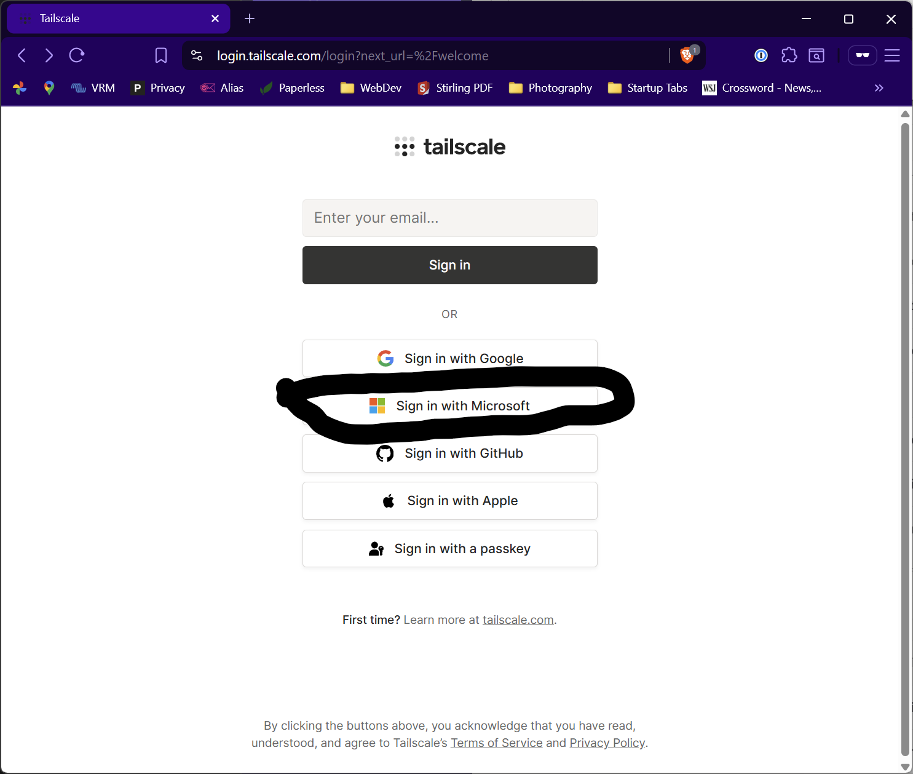

### Swinton Family Photo Server

Welcome to the Swinton family photo server.  The server runs a program called [Immich](https://immich.app/) which tries to be like Google Photos.  You access your photos either from a browser 
or from a smartphone app.  The server is not on the open internet -- it is only accessible using a product called Tailscale with provides a private encrypted channels 
between devices running Tailscale.  There are two steps to getting on the server: Setting up Tailscale and then logging into the photo server.

#### Setting up Tailscale
To get started, I will send you a username and password for Tailscale.  Your username will look like yourname@swintronics.com.  Follow these steps to login the first time.
-   Navigate to [Tailscale Login](https://login.tailscale.com/welcome) in your browser
-   Click the Sign in with Microsoft button and enter the username and password I sent to you.  I'm using Microsoft's  login system as a secure way to login.  It's not a corporate Microsoft account -- it's private to the six of us.  
-   Change your password when prompted.
-   Install Tailscale on the devices you will use to view or backup your photos.  I have it on my laptop and phone.
    
#### Logging into Immich
This one is easy.  I'll send you a Welcome email with a username and password.  Login to .  On my phone
